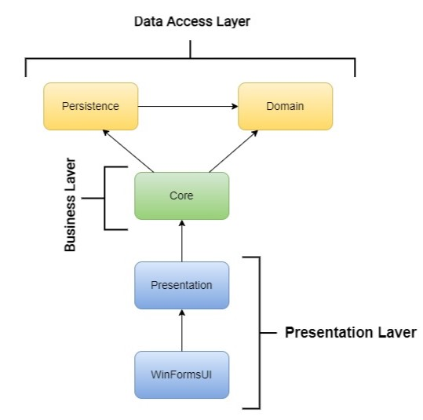
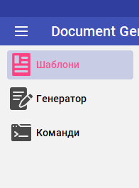
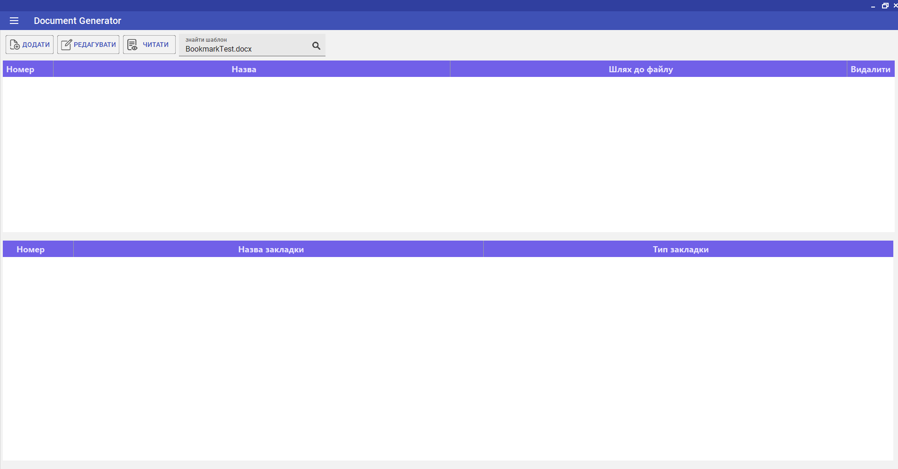
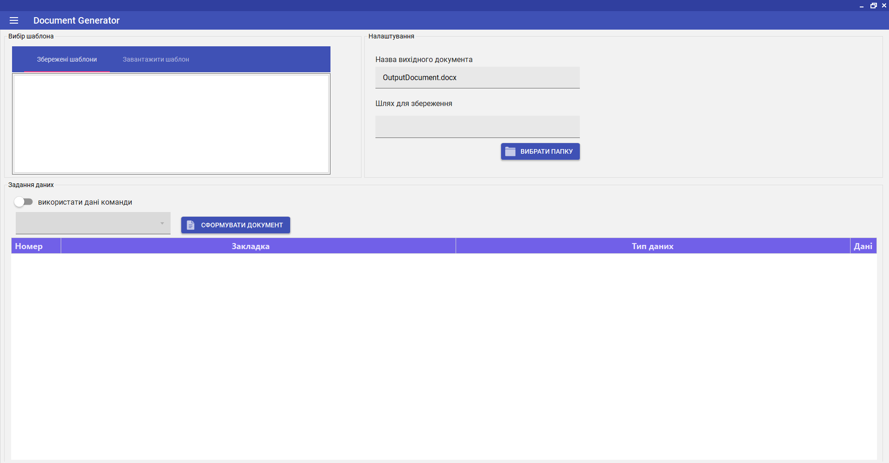
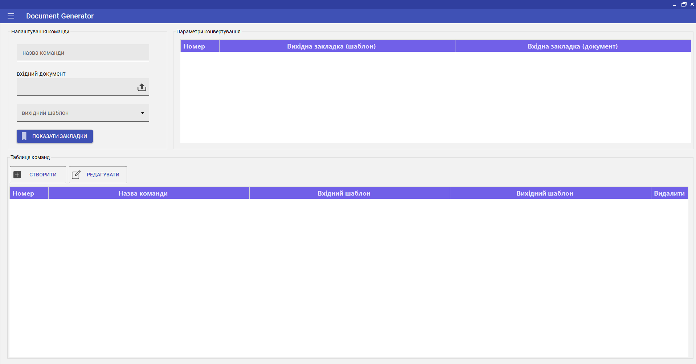

# DocumentGenerator
DocumentGenerator — це дипломний проєкт, мета якого розробити програму для поліпшення та спрощення процесу створення Word документів на основі шаблонів.
## Table of Contents
* [General Info](#general-information)
* [Technologies Used](#technologies-used)
* [Features](#features)
* [Screenshots](#screenshots)
* [Project Status](#project-status)
<!-- * [License](#license) -->
## General Info
Для розробки програми було обрано трирівневу архітектуру. Дані зберігаються з використанням бази даних SQLite.

Для реалізації проєкту Presentation було використано патерн MVP (Model-View-Presenter). Також для керування залежностями використовується патерн Dependency Injection.
## Technologies Used
- .NET - version 6.0;
- MaterialSkin.2 - version 2.3.1;
- Microsoft.Extensions.DependencyInjection - version 8.0.0;
- Microsoft.Extensions.Hosting - version 8.0.0;
- Microsoft-WindowsAPICodePack-Shell - version 1.1.5;
- System.Data.SQLite - version 1.0.118;
- Newtonsoft.Json - version 13.0.3;
- FreeSpire.Doc - version 12.2.0.
## Features
DocumentGenerator реалізовує такі можливості:
- завантаження шаблонів;
- експорт сформованих документів;
- створення документа на основі шаблону;
- створення команд для перетворення одного документа на інший.
## Screenshots
- Меню 
  
- Вкладка "Шаблони" 
  
- Вкладка "Генератор" 
  
- Вкладка "Команди" 
    

Відео-демонстраційний приклад роботи програми:

https://github.com/NikaBug/DocumentGenerator/assets/149799394/d8a01cd3-89fb-4a4e-9466-ff0f46b730b5

## Project Status
Завершено в червні 2024 року.
